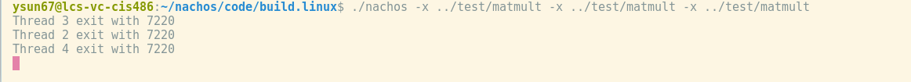

# Assignment 2

## Task 1

1. add 2 system call interface in syscall.h and 2 system call flag, `Fork_Pos` means fork a test thread, `Wait_POS` will block it parent process utill it call `Exit_POS` function.

```
#define SC_Fork_POS 43
#define SC_Wait_POS 44

int Fork_POS(int i);

void Wait_POS(int child_id); 
```

2. realize previoudly defined 2 system call in start.S
````
Fork_POS:
	addiu $2, $0, SC_Fork_POS
	syscall
	j 	$31
	.end Fork_POS

	.global Wait_POS
	.ent 	 Wait_POS
Wait_POS:
	addiu $2, $0, SC_Wait_POS
	syscall
	j 	$31
	.end Wait_POS
````

3. handle system call in kernel. In current kernel, system call is considered as a kind of exception to trap CPU, we can  handle this in **exception.cc**
```
case SC_Fork_POS:
{
	int i = (int)kernel->machine->ReadRegister(4);
	int tid = SysFork_POS(i);

	// kernel->waitingList->InsertPair(tid, kernel->currentThread);

	kernel->machine->WriteRegister(2, tid);

	kernel->interrupt->SetLevel(old);
}
break;
case SC_Wait_POS:
{
	int child_id = (int)kernel->machine->ReadRegister(4);

	// cout << "evoke wait " << child_id << endl;
	try
	{
		SysWait_POS(child_id);
	}
	catch (const std::exception &e)
	{
		std::cerr << e.what() << '\n';
	}

	kernel->interrupt->SetLevel(old);

	break;
	ASSERTNOTREACHED();
}
```

4. in current nachos design system call logic should in **ksyscall.h**
* *NOTE*: in **Wait_POS**, we should also check whether the thread to be waited is still running, if not a error will be thrown.
```
int SysFork_POS(int i)
{
  VoidFunctionPtr func;
  switch (i)
  {
  case 1:
    func = (VoidFunctionPtr)ForkTest1;
    break;
  case 2:
    func = (VoidFunctionPtr)ForkTest2;
    break;
  case 3:
    func = (VoidFunctionPtr)ForkTest3;
    break;
  default:
    cout << "error!!!";
  }
  Thread *threadtest = new Thread(kernel->currentThread->getName());
  int tid = threadtest->GetPid();
  threadtest->Fork(func, (void *)tid);
  return tid;
}

/*****************************************************
 * SysWait_POS
 *  **THROWABLE!!!!!!!!!!**
 * work as unix system call wait pid, if the child process
 * exist, it will block until child  finish
 * if thread not exit an InvaildIDException  will
 * be arouse
*/
void SysWait_POS(int child_id)
{
  // check whether thread alive
  IntStatus oldlevel = kernel->interrupt->SetLevel(IntOff);

  if (!kernel->scheduler->CheckThreadAlive(child_id))
  {
    throw InvaildIDException(child_id);
  }

  kernel->waitingList->InsertPair(child_id, kernel->currentThread);

  kernel->currentThread->Sleep(FALSE);
  kernel->interrupt->SetLevel(oldlevel);
}
```

5. reaize `Exit_POS` function
* get it parent from waiting list , If no parent waiting an error will be raised. If it's theres make it ready to run. If not, return.
* finishs current thread
```
// exit child process and awake their parent
void Exit_POS(int id)
{
  IntStatus oldlevel = kernel->interrupt->SetLevel(IntOff);
  Thread *parent = NULL;
  try
  {
    parent = kernel->waitingList->GetParent(id);
    kernel->waitingList->DeletePair(id);
    if(!kernel->waitingList->CheckBlocking(parent))
    {
      kernel->scheduler->ReadyToRun(parent);
    }
    kernel->currentThread->Finish();
    kernel->interrupt->SetLevel(oldlevel);

  }
  catch (const std::exception &ne)
  {
    std::cerr << ne.what() << '\n';
    return;
  }
  
  return;
}
```

6. the waiting queue design is in defined in `threadlist.h && threadlist.cc`

### snapshot

- **prog1**


In first test program every time a ForkPos test thread is created, the program main thread will sleep until child finsh and call `Exit_Pos` to let it run.

- **prog2**


1. thread whose pid are 3  ,4  created.
2. time interrupt happens, main thread take over and then it will call `Wait_POS(3)` and sleep.
3. thread 3 and thread 4 will run
4. thread 3 will wake up main thread
5. thread 4 finish, and it will try to wake up main, while acutully main is waked already, so an no parent waiting will happen
6. main thread try to `Wait_POS(4)`, however 4 is finished, an error will occur
7. main finish

- **prog3**


1. three thread will be forked and run.
2. main will finish
3. when child try to `Exit_Pos` find their parent, they will fail


-----------------------------------------------------

## Task2 

1. write system call is already define in **syscall.cc**, we just need to handle it
 **exception.cc**
* we can read the address(in simulate machine) of the string we want to write from register and the size from register 5;
```
case SC_Write:
{
	int nbuf_addr = (int)kernel->machine->ReadRegister(4);
	int size = (int)kernel->machine->ReadRegister(5);
	int openfid = (int)kernel->machine->ReadRegister(6);
	// assume the buffer here is not very large , read at one time
	string buf = "";
	int res = 0;
	for (int i = 0; i < size; i++)
	{
		int temp;
		if (!kernel->machine->ReadMem(nbuf_addr, sizeof(char), &temp))
		{
			cerr << "valid memory access!!"
				 << "/n";
			res = -1;
			break;
		}
		nbuf_addr += sizeof(char);
		buf += (char)temp;
	}
	//char* m = buf.c_str();
	res = SysWrite(const_cast<char *>(buf.c_str()), size, openfid);
	kernel->machine->WriteRegister(2, res);
	// cout << buf << endl;

	kernel->interrupt->SetLevel(old);
	break;
	ASSERTNOTREACHED();
}
```
* the openfile id in test program is set to `ConsoleOutput`, currently, nachos's file system is not compiled due to *FILESYS_STUB* pre-porcessing flag, what we write will be directly send to *NIX's file, it's lucky that in nachos, `ConsoleOutput` is 1 ,sam e as *NIX,we just need to directly call nachos filesys Interface.
```
int SysWrite(char *buffer, int size, OpenFileId id)
{
  WriteFile(id, buffer, size);
  return size;
}
```

2. In order to run multi user program, we need to allocated different address for different program
* we can use a bitmap to mark the address in MainMemory who is in use 

```
Bitmap *memMap;         // a bitmap to check the usage of memory
```

* when locate a memory we can use `FindAndSet()` to calculate the number of memory we can assign. This can gurantee the physical address of our system would not have overlap

```
pageTable = new TranslationEntry[numPages];
std::list<int> pageInSwap; // page needed to be allocated in Swap
std::list<int> pageInMem;  // page needed to be allocated in MainMem
for (int i = 0; i < numPages; i++)
{
    pageTable[i].virtualPage = i;        // for now, it is contigues page allocation
    if (kernel->memMap->NumClear() == 0) // if main memory is full, the address is on swap
    {
        int swapaddr = kernel->swapdisk->AllocatePage("");
        pageTable[i].physicalPage = swapaddr;
        pageTable[i].valid = FALSE; // swap is not in main memory, it is
                                    // invalid !!!!
        pageInSwap.push_back(swapaddr);
    }
    else
    {
        int memaddr = kernel->memMap->FindAndSet();
        pageTable[i].physicalPage = memaddr;
        pageTable[i].valid = TRUE;
        pageInMem.push_back(memaddr);
        kernel->phyPageList.push_back(make_pair(memaddr, this)); // put it in in-use-page list
    }
    pageTable[i].use = FALSE;
    pageTable[i].dirty = FALSE;
    pageTable[i].readOnly = FALSE;
}
```

### snaphot


---------------------------------------------

## Task3

1. If in program load procedure, main memory is too small to hold all program. For exmample, load three `maltmat` programs. The memory size now is 128 * 128, three `maltmat` will occupy 3 * 55 * 128.
2. I use virtual memory strategy to solve this problem:
- use a swap file(in my current design, I use  opeartor class `SwapDisk` to manange it )
- swap will extend the main memory from 128 pages to 256 pages. Which means, the page whose physical address is 128 * 128 ~ 256 * 128 will be stored on `SwapDisk`
```

const int SwapSize = 128;             // max page number
const int SwapStartPageNum = 128;     // Swap's mapped address in memory start from the 
                                      // end of main memory,

// class OpenFile;

class SwapDisk
{
  private:
    std::array<std::string, SwapSize> swapMemory;
    Bitmap* bitmap;

  public:
    SwapDisk();
    ~SwapDisk();
    int AllocatePage(std::string content);
    // char* SwitchPage(int swapaddr, char *content);
    string ReadAt(unsigned int swapaddr);
    void WriteAt(unsigned int swapaddr, std::string);
    void ClearAPage(int swapaddr);

    bool CopyFromFile(OpenFile *file, int numBytes, int position, std::list<int> &dest_addrs);
                                      // copy the content of a file to some address
                                      // the address value in dest_addrs should be valid!
                                      // REFECTOR: some exception need to be thrown here
    // void Load();
    void Flush();
    int Remains();
};
```
- I use FIFO queue to deal with page replacement, all main memory physcial number in use will be stored there

```
list<pair<int, AddrSpace*>> phyPageList;     // keep track of the page in use, the key is page number 
                                               // value is the pcb who own this page, current it is using 
                                               // a FIFO update strategy.(support FIFO replace algorithm) 
```
- In loading progress the content can't be load to main memory need to be written in `SwapDisk`
```
if (noffH.code.size > 0)
    {
        DEBUG(dbgAddr, "Initializing code segment.");
        DEBUG(dbgAddr, noffH.code.virtualAddr << ", " << noffH.code.size);
        if (noffH.code.size + current < MemorySize) // check whether all page in memory
        {
            kernel->AllocateMem(executable, noffH.code.size, noffH.code.inFileAddr, pageInMem);
        }
        else // some thing allocated in swap~
        {
            int inMemSize = MemorySize - current;
            int inSwapSize = noffH.code.size + current - MemorySize;
            if (inMemSize > 0)
            {
                kernel->AllocateMem(executable, inMemSize, noffH.code.inFileAddr, pageInMem);
            }
            kernel->swapdisk->CopyFromFile(executable, inSwapSize, noffH.code.inFileAddr + inMemSize, pageInSwap);
        }
        current += noffH.code.size;
    }
    if (noffH.initData.size > 0)
    {
        DEBUG(dbgAddr, "Initializing data segment.");
        DEBUG(dbgAddr, noffH.initData.virtualAddr << ", " << noffH.initData.size);
        if (noffH.initData.size + current < MemorySize) // check whether all page in memory
        {
            kernel->AllocateMem(executable, noffH.initData.size, noffH.initData.inFileAddr, pageInMem);
        }
        else // some thing allocated in swap~
        {
            int inMemSize = MemorySize - current;
            int inSwapSize = noffH.initData.size + current - MemorySize;
            if (inMemSize > 0)
            {
                kernel->AllocateMem(executable, inMemSize, noffH.initData.inFileAddr, pageInMem);
            }
            kernel->swapdisk->CopyFromFile(executable, inSwapSize, noffH.initData.inFileAddr + inMemSize, pageInSwap);
        }
        current += noffH.initData.size;
    }

#ifdef RDATA
    if (noffH.readonlyData.size > 0)
    {
        DEBUG(dbgAddr, "Initializing read only data segment.");
        DEBUG(dbgAddr, noffH.readonlyData.virtualAddr << ", " << noffH.readonlyData.size);
        if (noffH.readonlyData.size + current < MemorySize) // check whether all page in memory
        {
            kernel->AllocateMem(executable, noffH.readonlyData.size, noffH.readonlyData.inFileAddr, pageInMem);
        }
        else // some thing allocated in swap~
        {
            int inMemSize = MemorySize - current;
            int inSwapSize = noffH.readonlyData.size + current - MemorySize;
            if (inMemSize > 0)
            {
                kernel->AllocateMem(executable, inMemSize, noffH.readonlyData.inFileAddr, pageInMem);
            }
            kernel->swapdisk->CopyFromFile(executable, inSwapSize, noffH.readonlyData.inFileAddr + inMemSize, pageInSwap);
        }
        current += noffH.readonlyData.size;
    }
#endif

    // zero out the page allocated in swap !
    if (pageInSwap.size() > 0)
    {
        auto it = pageInSwap.begin();
        while (it != pageInSwap.end())
        {
            std::string zero = "";
            for (int i = 0; i < PageSize; i++)
            {
                zero += '\0';
            }
            kernel->swapdisk->WriteAt((*it), zero);
            it++;
        }
    }
``` 
```
bool SwapDisk::CopyFromFile(OpenFile *file, int numBytes, int position, std::list<int> &dest_addrs)
{
    int fileLength = file->Length();
    int firstPage, lastPage, numPages;
    char *buf;

    if ((numBytes <= 0) || (position >= fileLength))
        return false; // check request
    if ((position + numBytes) > fileLength)
        numBytes = fileLength - position;

    firstPage = divRoundDown(position, PageSize);
    lastPage = divRoundDown(position + numBytes - 1, PageSize);
    numPages = 1 + lastPage - firstPage;

    // read in all data we need
    buf = new char[numPages * PageSize];
    bzero(&buf[0], numPages * PageSize);
    // ASSERT(buf == &buf[0])
    file->ReadAt(&buf[0], numBytes, position);

    // convert char* to string
    std::string tmp = "";
    int i;
    for(i = 0; i < numPages * PageSize; i++)
    {
        tmp += buf[i];
    }
    //
    // cout << "num page to write " << numPages << " page num in dest_addr " <<dest_addrs.size() << "\n";
    for (i = 0; i < numPages; i++)
    {
        // this is based on virtual address, suppose it is linear!
        int target = dest_addrs.front();
        dest_addrs.pop_front();
        this->WriteAt(target, tmp.substr(i * PageSize, PageSize)); // write one page a time
    }

    delete buf;
    return true;
}

```
- If a thread is finished, it block in page FIFO list should also be cleared

```
void
Thread::Finish ()
{
    (void) kernel->interrupt->SetLevel(IntOff);		
    ASSERT(this == kernel->currentThread);

    // when a thread is finished, it's page should be restored

    auto it = kernel->phyPageList.begin();
    if (kernel->phyPageList.size() > 0)
    {
        while (it != kernel->phyPageList.end())
        {
            // auto tmp = it;
            // find page belong to this thread
            if ((*it).second == this->space)
            {
                kernel->memMap->Clear((*it).first);
                it = kernel->phyPageList.erase(it);
            }
            else
            {
                it++;
            }
        }
    }

    DEBUG(dbgThread, "Finishing thread: " << name);
    
    Sleep(TRUE);				// invokes SWITCH
    // not reached
}

```

### snapshot




### explain 

Orignally, only two matlmult can be loaded with page more than three can be used 


# Task4

* add a quantum to kernel and read it from `argv`

```
    else if(strcmp(argv[i], "-quantum") == 0)
    {
        ASSERT(i + 1 < argc); // next argument is int
        quantum = atoi(argv[i + 1]);
        i++;
    }
```

* then in **alarm.cc** (time interrupt handler), every quantum size arise an valid callback

```
void 
Alarm::CallBack() 
{
    Interrupt *interrupt = kernel->interrupt;
    MachineStatus status = interrupt->getStatus();
    
    if (counter < kernel->quantum)
    {
        counter++;
        return;
    }
    else
    {
        counter = 0;
    }
    if (status != IdleMode) {
	interrupt->YieldOnReturn();
    }
}

```

### snapshot


if the quantum size is large enough. prog1 will finish first and then the second one.
------------------------------

Code:

**addrspace.cc**

```
#include "copyright.h"
#include "main.h"
#include "addrspace.h"
#include "machine.h"
#include "noff.h"
// #include <list>

int AddrSpace::mark = 0;

static void 
SwapHeader (NoffHeader *noffH)
{
    noffH->noffMagic = WordToHost(noffH->noffMagic);
    noffH->code.size = WordToHost(noffH->code.size);
    noffH->code.virtualAddr = WordToHost(noffH->code.virtualAddr);
    noffH->code.inFileAddr = WordToHost(noffH->code.inFileAddr);
#ifdef RDATA
    noffH->readonlyData.size = WordToHost(noffH->readonlyData.size);
    noffH->readonlyData.virtualAddr = 
           WordToHost(noffH->readonlyData.virtualAddr);
    noffH->readonlyData.inFileAddr = 
           WordToHost(noffH->readonlyData.inFileAddr);
#endif 
    noffH->initData.size = WordToHost(noffH->initData.size);
    noffH->initData.virtualAddr = WordToHost(noffH->initData.virtualAddr);
    noffH->initData.inFileAddr = WordToHost(noffH->initData.inFileAddr);
    noffH->uninitData.size = WordToHost(noffH->uninitData.size);
    noffH->uninitData.virtualAddr = WordToHost(noffH->uninitData.virtualAddr);
    noffH->uninitData.inFileAddr = WordToHost(noffH->uninitData.inFileAddr);

#ifdef RDATA
    DEBUG(dbgAddr, "code = " << noffH->code.size <<  
                   " readonly = " << noffH->readonlyData.size <<
                   " init = " << noffH->initData.size <<
                   " uninit = " << noffH->uninitData.size << "\n");
#endif
}

AddrSpace::AddrSpace()
{
}

//----------------------------------------------------------------------
// AddrSpace::~AddrSpace
// 	Dealloate an address space.
//----------------------------------------------------------------------

AddrSpace::~AddrSpace()
{
   delete pageTable;
}


//----------------------------------------------------------------------
// AddrSpace::Load
// 	Load a user program into memory from a file.
//
//	Assumes that the page table has been initialized, and that
//	the object code file is in NOFF format.
//
//	"fileName" is the file containing the object code to load into memory
//----------------------------------------------------------------------

bool 
AddrSpace::Load(char *fileName)
{
    int prevMemUsed = PageSize - kernel->memMap->NumClear();
    OpenFile *executable = kernel->fileSystem->Open(fileName);
    NoffHeader noffH;
    unsigned int size;

    if (executable == NULL)
    {
        cerr << "Unable to open file " << fileName << "\n";
        return FALSE;
    }

    executable->ReadAt((char *)&noffH, sizeof(noffH), 0);
    if ((noffH.noffMagic != NOFFMAGIC) &&
        (WordToHost(noffH.noffMagic) == NOFFMAGIC))
        SwapHeader(&noffH);
    ASSERT(noffH.noffMagic == NOFFMAGIC);

#ifdef RDATA
    // how big is address space?
    size = noffH.code.size + noffH.readonlyData.size + noffH.initData.size +
           noffH.uninitData.size + UserStackSize;
    // we need to increase the size
    // to leave room for the stack
#else
    // how big is address space?
    size = noffH.code.size + noffH.initData.size + noffH.uninitData.size + UserStackSize; // we need to increase the size
                                                                                          // to leave room for the stack
#endif
    numPages = divRoundUp(size, PageSize);
    size = numPages * PageSize;

    // ASSERT(numPages <= NumPhysPages);		// check we're not trying
    // to run anything too big --
    // at least until we have
    // virtual memory
    // we have now OwO!

    DEBUG(dbgAddr, "Initializing address space: " << numPages << ", " << size);

    pageTable = new TranslationEntry[numPages];
    std::list<int> pageInSwap; // page needed to be allocated in Swap
    std::list<int> pageInMem;  // page needed to be allocated in MainMem
    for (int i = 0; i < numPages; i++)
    {
        pageTable[i].virtualPage = i;        // for now, it is contigues page allocation
        if (kernel->memMap->NumClear() == 0) // if main memory is full, the address is on swap
        {
            int swapaddr = kernel->swapdisk->AllocatePage("");
            pageTable[i].physicalPage = swapaddr;
            pageTable[i].valid = FALSE; // swap is not in main memory, it is
                                        // invalid !!!!
            pageInSwap.push_back(swapaddr);
        }
        else
        {
            int memaddr = kernel->memMap->FindAndSet();
            pageTable[i].physicalPage = memaddr;
            pageTable[i].valid = TRUE;
            pageInMem.push_back(memaddr);
            kernel->phyPageList.push_back(make_pair(memaddr, this)); // put it in in-use-page list
        }
        pageTable[i].use = FALSE;
        pageTable[i].dirty = FALSE;
        pageTable[i].readOnly = FALSE;
    }

    int current = prevMemUsed * PageSize; // counter

    // then, copy in the code and data segments into memory
    // Note: this code assumes that virtual address = physical address
    if (noffH.code.size > 0)
    {
        DEBUG(dbgAddr, "Initializing code segment.");
        DEBUG(dbgAddr, noffH.code.virtualAddr << ", " << noffH.code.size);
        if (noffH.code.size + current < MemorySize) // check whether all page in memory
        {
            kernel->AllocateMem(executable, noffH.code.size, noffH.code.inFileAddr, pageInMem);
        }
        else // some thing allocated in swap~
        {
            int inMemSize = MemorySize - current;
            int inSwapSize = noffH.code.size + current - MemorySize;
            if (inMemSize > 0)
            {
                kernel->AllocateMem(executable, inMemSize, noffH.code.inFileAddr, pageInMem);
            }
            kernel->swapdisk->CopyFromFile(executable, inSwapSize, noffH.code.inFileAddr + inMemSize, pageInSwap);
        }
        current += noffH.code.size;
    }
    if (noffH.initData.size > 0)
    {
        DEBUG(dbgAddr, "Initializing data segment.");
        DEBUG(dbgAddr, noffH.initData.virtualAddr << ", " << noffH.initData.size);
        if (noffH.initData.size + current < MemorySize) // check whether all page in memory
        {
            kernel->AllocateMem(executable, noffH.initData.size, noffH.initData.inFileAddr, pageInMem);
        }
        else // some thing allocated in swap~
        {
            int inMemSize = MemorySize - current;
            int inSwapSize = noffH.initData.size + current - MemorySize;
            if (inMemSize > 0)
            {
                kernel->AllocateMem(executable, inMemSize, noffH.initData.inFileAddr, pageInMem);
            }
            kernel->swapdisk->CopyFromFile(executable, inSwapSize, noffH.initData.inFileAddr + inMemSize, pageInSwap);
        }
        current += noffH.initData.size;
    }

#ifdef RDATA
    if (noffH.readonlyData.size > 0)
    {
        DEBUG(dbgAddr, "Initializing read only data segment.");
        DEBUG(dbgAddr, noffH.readonlyData.virtualAddr << ", " << noffH.readonlyData.size);
        if (noffH.readonlyData.size + current < MemorySize) // check whether all page in memory
        {
            kernel->AllocateMem(executable, noffH.readonlyData.size, noffH.readonlyData.inFileAddr, pageInMem);
        }
        else // some thing allocated in swap~
        {
            int inMemSize = MemorySize - current;
            int inSwapSize = noffH.readonlyData.size + current - MemorySize;
            if (inMemSize > 0)
            {
                kernel->AllocateMem(executable, inMemSize, noffH.readonlyData.inFileAddr, pageInMem);
            }
            kernel->swapdisk->CopyFromFile(executable, inSwapSize, noffH.readonlyData.inFileAddr + inMemSize, pageInSwap);
        }
        current += noffH.readonlyData.size;
    }
#endif

    // zero out the page allocated in swap !
    if (pageInSwap.size() > 0)
    {
        auto it = pageInSwap.begin();
        while (it != pageInSwap.end())
        {
            std::string zero = "";
            for (int i = 0; i < PageSize; i++)
            {
                zero += '\0';
            }
            kernel->swapdisk->WriteAt((*it), zero);
            it++;
        }
    }

    // ASSERT(pageInMem.size() == 0)
    mark += numPages;
    delete executable; // close file
    return TRUE;       // success
}

//----------------------------------------------------------------------
// AddrSpace::Execute
// 	Run a user program using the current thread
//
//      The program is assumed to have already been loaded into
//      the address space
//
//----------------------------------------------------------------------

void 
AddrSpace::Execute() 
{

    kernel->currentThread->space = this;

    this->InitRegisters();		// set the initial register values
    this->RestoreState();		// load page table register

    kernel->machine->Run();		// jump to the user progam

    ASSERTNOTREACHED();			// machine->Run never returns;
					// the address space exits
					// by doing the syscall "exit"
}

void
AddrSpace::InitRegisters()
{
    Machine *machine = kernel->machine;
    int i;

    for (i = 0; i < NumTotalRegs; i++)
	machine->WriteRegister(i, 0);

    // Initial program counter -- must be location of "Start", which
    //  is assumed to be virtual address zero
    machine->WriteRegister(PCReg, 0);	

    // Need to also tell MIPS where next instruction is, because
    // of branch delay possibility
    // Since instructions occupy four bytes each, the next instruction
    // after start will be at virtual address four.
    machine->WriteRegister(NextPCReg, 4);

   // Set the stack register to the end of the address space, where we
   // allocated the stack; but subtract off a bit, to make sure we don't
   // accidentally reference off the end!
    machine->WriteRegister(StackReg, numPages * PageSize - 16);
    DEBUG(dbgAddr, "Initializing stack pointer: " << numPages * PageSize - 16);
}

//----------------------------------------------------------------------
// AddrSpace::SaveState
// 	On a context switch, save any machine state, specific
//	to this address space, that needs saving.
//
//	For now, don't need to save anything!
//----------------------------------------------------------------------

void AddrSpace::SaveState() 
{}

//----------------------------------------------------------------------
// AddrSpace::RestoreState
// 	On a context switch, restore the machine state so that
//	this address space can run.
//
//      For now, tell the machine where to find the page table.
//----------------------------------------------------------------------

void AddrSpace::RestoreState() 
{
    kernel->machine->pageTable = pageTable;
    kernel->machine->pageTableSize = numPages;
}


//----------------------------------------------------------------------
// AddrSpace::Translate
//  Translate the virtual address in _vaddr_ to a physical address
//  and store the physical address in _paddr_.
//  The flag _isReadWrite_ is false (0) for read-only access; true (1)
//  for read-write access.
//  Return any exceptions caused by the address translation.
//----------------------------------------------------------------------
ExceptionType
AddrSpace::Translate(unsigned int vaddr, unsigned int *paddr, int isReadWrite)
{
    TranslationEntry *pte;
    int               pfn;
    unsigned int      vpn    = vaddr / PageSize;
    unsigned int      offset = vaddr % PageSize;

    if(vpn >= numPages) {
        return AddressErrorException;
    }

    pte = &pageTable[vpn];

    if(isReadWrite && pte->readOnly) {
        return ReadOnlyException;
    }

    pfn = pte->physicalPage;

    // if the pageFrame is too big, there is something really wrong!
    // An invalid translation was loaded into the page table or TLB.
    if (pfn >= NumPhysPages + SwapSize) {
        DEBUG(dbgAddr, "Illegal physical page " << pfn);
        return BusErrorException;
    }

    pte->use = TRUE;          // set the use, dirty bits

    if(isReadWrite)
        pte->dirty = TRUE;

    *paddr = pfn*PageSize + offset;

    // ASSERT((*paddr < MemorySize));

    //cerr << " -- AddrSpace::Translate(): vaddr: " << vaddr <<
    //  ", paddr: " << *paddr << "\n";

    return NoException;
}

// TODO: change param name!!!!!!!
bool 
AddrSpace::ModifyPTE(int phyNum, int vNum)
{
    for(int i=0; i < numPages; i++)
    {
        if(pageTable[i].physicalPage == phyNum)
        {
            pageTable[i].physicalPage = vNum;
            if(vNum >= 128)
            {
                pageTable[i].valid = FALSE;
            }
            else
            {
                pageTable[i].valid = TRUE;
            }
            return true;
        }
    }
    ASSERTNOTREACHED();
}
```

**exception.cc**
```
#include "copyright.h"
#include "main.h"
#include "syscall.h"
#include "ksyscall.h"
void ExceptionHandler(ExceptionType which)
{
	int type = kernel->machine->ReadRegister(2);

	DEBUG(dbgSys, "Received Exception " << which << " type: " << type << "\n");
	IntStatus old = kernel->interrupt->SetLevel(IntOff);

	switch (which)
	{
	case SyscallException:
	{
		switch (type)
		{
		case SC_Exit:
		{
			// Exit_POS(kernel->currentThread->GetPid());
			/* Modify return point */
			int res = (int)kernel->machine->ReadRegister(4);
			cout << "Thread " << kernel->currentThread->GetPid() << " exit with " << res << "\n";
			Thread *oldThread = kernel->currentThread;
			oldThread->Finish();
			kernel->machine->WriteRegister(2, 0);
			kernel->interrupt->SetLevel(old);
			break;
		}

		case SC_Halt:
		{
			DEBUG(dbgSys, "Shutdown, initiated by user program.\n");

			SysHalt();

			ASSERTNOTREACHED();
		}
		break;
		case SC_Add:
		{
			DEBUG(dbgSys, "Add " << kernel->machine->ReadRegister(4) << " + " << kernel->machine->ReadRegister(5) << "\n");

			/* Process SysAdd Systemcall*/
			int result;
			result = SysAdd(/* int op1 */ (int)kernel->machine->ReadRegister(4),
							/* int op2 */ (int)kernel->machine->ReadRegister(5));

			DEBUG(dbgSys, "Add returning with " << result << "\n");
			/* Prepare Result */
			kernel->machine->WriteRegister(2, (int)result);

			kernel->interrupt->SetLevel(old);
			break;
		}

		case SC_Open:
		{
			int nbuf_addr = (int)kernel->machine->ReadRegister(4);
			string name = "";
			int tmp = -1;
			OpenFileId fid = 0;
			while ((int)tmp != 0)
			{
				if (!kernel->machine->ReadMem(nbuf_addr, sizeof(char), &tmp))
				{
					cerr << "valid memory access!!"
						 << "/n";
					fid = -1;
					break;
				}
				nbuf_addr += sizeof(char);
				name += (char)tmp;
			}
			fid = SysOpen(const_cast<char *>(name.c_str()));
			kernel->machine->WriteRegister(2, fid);
			cout << name << "\n";
			
			kernel->interrupt->SetLevel(old);
			break;
		}
		case SC_Write:
		{
			int nbuf_addr = (int)kernel->machine->ReadRegister(4);
			int size = (int)kernel->machine->ReadRegister(5);
			int openfid = (int)kernel->machine->ReadRegister(6);
			// assume the buffer here is not very large , read at one time
			string buf = "";
			int res = 0;
			for (int i = 0; i < size; i++)
			{
				int temp;
				if (!kernel->machine->ReadMem(nbuf_addr, sizeof(char), &temp))
				{
					cerr << "valid memory access!!"
						 << "/n";
					res = -1;
					break;
				}
				nbuf_addr += sizeof(char);
				buf += (char)temp;
			}
			//char* m = buf.c_str();
			res = SysWrite(const_cast<char *>(buf.c_str()), size, openfid);
			kernel->machine->WriteRegister(2, res);
			// cout << buf << endl;

			kernel->interrupt->SetLevel(old);
			break;
			ASSERTNOTREACHED();
		}
		case SC_Fork_POS:
		{
			int i = (int)kernel->machine->ReadRegister(4);
			int tid = SysFork_POS(i);

			// kernel->waitingList->InsertPair(tid, kernel->currentThread);

			kernel->machine->WriteRegister(2, tid);

			kernel->interrupt->SetLevel(old);
		}
		break;
		case SC_Wait_POS:
		{
			int child_id = (int)kernel->machine->ReadRegister(4);

			// cout << "evoke wait " << child_id << endl;
			try
			{
				SysWait_POS(child_id);
			}
			catch (const std::exception &e)
			{
				std::cerr << e.what() << '\n';
			}

			kernel->interrupt->SetLevel(old);

			break;
			ASSERTNOTREACHED();
		}
		default:
		{
			cerr << "Unexpected system call " << type << "\n";
			kernel->interrupt->SetLevel(old);

			break;
		}
		}
		break;
	}
	case PageFaultException:
	{
		// handle page fault here
		int vaddr = kernel->machine->ReadRegister(BadVAddrReg);
		AddrSpace *space = kernel->currentThread->space; // current pcb
		unsigned int phyaddr;
		ExceptionType ex = space->Translate(vaddr, &phyaddr, FALSE);
		ASSERT(ex == NoException)
		unsigned int faultPage = phyaddr / PageSize;
		// cout << "fault page is " << faultPage << endl;
		int toBeReplaced;
		if (faultPage >= 128 && faultPage <= 256) // page is in swap, replace page here
		{
			// read original page out
			std::string faultPageContent = kernel->swapdisk->ReadAt(faultPage);
			kernel->swapdisk->ClearAPage(faultPage);	
			if (kernel->memMap->NumClear() > 0)
			{
				toBeReplaced = kernel->memMap->FindAndSet();
			}
			else
			{
				// ASSERT(!kernel->phyPageList.empty());
				auto head = (kernel->phyPageList).begin();
				toBeReplaced = (*head).first;
				AddrSpace *prevPcb = (*head).second;
				kernel->phyPageList.pop_front();
				// read the block need to be swap from main memory
				std::string content = "";
				for (int i = 0; i < PageSize; i++)
				{
					content += kernel->machine->mainMemory[(toBeReplaced*PageSize)+i];
				}
				// write a physical memory into swap!
				int swappage = kernel->swapdisk->AllocatePage(content);

				prevPcb->ModifyPTE(toBeReplaced, swappage);
			}
			// modify page table in current thread to make it translatable
			AddrSpace *currentPcb = kernel->currentThread->space;
			currentPcb->ModifyPTE(faultPage, toBeReplaced);
			kernel->phyPageList.push_back(make_pair(toBeReplaced, currentPcb));

			// write fault page to memory
			auto it = faultPageContent.begin();
			int i = 0;
			while (it != faultPageContent.end())
			{
				kernel->machine->mainMemory[(toBeReplaced*PageSize)+i] = (*it);
				i++;
				it++;
			}
		}
		return;
	}
	case AddressErrorException:
	{
		// it may happen is one program itself is too big, vm may larger than mem size
		// this condition is actual will not effect translation result..... it is just
		// catched here, no need for handle!
		// OutOfMemory's condition is handled when program is loaded, in current nachos
		// heap hasn't realized and stack is fixed, which means we do not need to worry
		// about OOM in runtime.

		return;
	}
	default:
	{
		cerr << "Unexpected user mode exception" << (int)which << "\n";
		break;
	}
	}
	/* Modify return point */
	{
		/* set previous programm counter (debugging only)*/
		kernel->machine->WriteRegister(PrevPCReg, kernel->machine->ReadRegister(PCReg));

		/* set programm counter to next instruction (all Instructions are 4 byte wide)*/
		kernel->machine->WriteRegister(PCReg, kernel->machine->ReadRegister(PCReg) + 4);

		/* set next programm counter for brach execution */
		kernel->machine->WriteRegister(NextPCReg, kernel->machine->ReadRegister(PCReg) + 4);
	}
	kernel->interrupt->SetLevel(IntOff);
}

```

**swapdisk.h**
```
// SwapDisk.h
// this is a simulation of a hard disk in nachos, it is extension of main memory!
// but this swap disk is not in nachos's file system, it is in **host**
// physical memory. It mapped to physical page number 128~256.(virtual memory in
// windows, swap in linux). 
// it will work as /swap partition in *NIX operation system, when user program 
// try to access physical memory 128 ~ 256 page, it will read from here 
// this ram disk can also support fulsh back into nachos disk with a serialized
// swaped page entry(virtual page number and memeroy content)
// (in this case I will use normal format stringfy to do serialzation with
// stl's sstream, if boost is possile, plz change to that).

#ifndef RAM_DISK_H
#define RAM_DISK_H

#include <map>
#include <sstream>
#include <array>
#include <list>
#include "bitmap.h"
#include "machine.h"
#include "openfile.h"

using SwapedPageEnty = std::map<int, std::string>;

const int SwapSize = 128;             // max page number
const int SwapStartPageNum = 128;     // Swap's mapped address in memory start from the 
                                      // end of main memory,

// class OpenFile;

class SwapDisk
{
  private:
    std::array<std::string, SwapSize> swapMemory;
    Bitmap* bitmap;

  public:
    SwapDisk();
    ~SwapDisk();
    int AllocatePage(std::string content);
    // char* SwitchPage(int swapaddr, char *content);
    string ReadAt(unsigned int swapaddr);
    void WriteAt(unsigned int swapaddr, std::string);
    void ClearAPage(int swapaddr);

    bool CopyFromFile(OpenFile *file, int numBytes, int position, std::list<int> &dest_addrs);
                                      // copy the content of a file to some address
                                      // the address value in dest_addrs should be valid!
                                      // REFECTOR: some exception need to be thrown here
    // void Load();
    void Flush();
    int Remains();
};

#endif
```


**swapdisk.cc**
```
#include "swapdisk.h"
#include "main.h"

SwapDisk::SwapDisk()
{
    bitmap = new Bitmap(SwapSize);
}

SwapDisk::~SwapDisk()
{
    delete bitmap;
}

// char *SwapDisk::SwitchPage(int swapaddr, char *content)
// {
//     std::string str_content(content);
//     char* ret = const_cast<char*>(swapMemory[(swapaddr-SwapStartPageNum)].c_str());
//     swapMemory[(swapaddr-SwapStartPageNum)] = str_content;
// }

int SwapDisk::AllocatePage(std::string content)
{
    // int n = bitmap->NumClear();
    int addr = bitmap->FindAndSet();
    ASSERT(addr != -1);
    swapMemory[addr] = content;
    return addr + SwapStartPageNum;
}

void SwapDisk::ClearAPage(int swapaddr)
{
    ASSERT(bitmap->Test(swapaddr-SwapStartPageNum))
    bitmap->Clear(swapaddr - SwapStartPageNum);
}

int SwapDisk::Remains()
{
    return bitmap->NumClear();
}

string SwapDisk::ReadAt(unsigned int swapaddr)
{
    ASSERT(bitmap->Test(swapaddr-SwapStartPageNum))
    //ASSERT(swapMemory[(swapaddr - SwapStartPageNum)] == "")
    string ret  = swapMemory[(swapaddr - SwapStartPageNum)];
    if(ret == "")
    {
        cout <<"here";
    }
    return ret;
}

void SwapDisk::WriteAt(unsigned int swapaddr, std::string content)
{
    // it an address is not allocated yet, it should not be written!!!
    // although it's owner haven't be check !
    // for security concern, it's associated PCB should be check later
    ASSERT(bitmap->Test(swapaddr-SwapStartPageNum));
    swapMemory[swapaddr-SwapStartPageNum] = content;
}

#ifdef FILESYS_STUB

bool SwapDisk::CopyFromFile(OpenFile *file, int numBytes, int position, std::list<int> &dest_addrs)
{
    int fileLength = file->Length();
    int firstPage, lastPage, numPages;
    char *buf;

    if ((numBytes <= 0) || (position >= fileLength))
        return false; // check request
    if ((position + numBytes) > fileLength)
        numBytes = fileLength - position;

    firstPage = divRoundDown(position, PageSize);
    lastPage = divRoundDown(position + numBytes - 1, PageSize);
    numPages = 1 + lastPage - firstPage;

    // read in all data we need
    buf = new char[numPages * PageSize];
    bzero(&buf[0], numPages * PageSize);
    // ASSERT(buf == &buf[0])
    file->ReadAt(&buf[0], numBytes, position);

    // convert char* to string
    std::string tmp = "";
    int i;
    for(i = 0; i < numPages * PageSize; i++)
    {
        tmp += buf[i];
    }
    //
    // cout << "num page to write " << numPages << " page num in dest_addr " <<dest_addrs.size() << "\n";
    for (i = 0; i < numPages; i++)
    {
        // this is based on virtual address, suppose it is linear!
        int target = dest_addrs.front();
        dest_addrs.pop_front();
        this->WriteAt(target, tmp.substr(i * PageSize, PageSize)); // write one page a time
    }

    delete buf;
    return true;
}

#else

#include "synchdisk.h"
#include "filehdr.h"

bool SwapDisk::CopyFromFile(OpenFile *file, int numBytes, int position, const std::vector<int> &dest_addrs)
{
    int fileLength = file->Length();
    int firstPage, lastPage, numPages;
    char *buf;

    if ((numBytes <= 0) || (position >= fileLength))
        return false; // check request
    if ((position + numBytes) > fileLength)
        numBytes = fileLength - position;
    // DEBUG(dbgFile, "Reading " << numBytes << " bytes at " << position << " from file of length " << fileLength);

    firstPage = divRoundDown(position, PageSize);
    lastPage = divRoundDown(position + numBytes - 1, PageSize);
    numPages = 1 + lastPage - firstPage;

    // read in all the full and partial sectors that we need
    buf = new char[numPages * PageSize];
    for (int i = firstPage; i <= lastPage; i++)
    {
        FileHeader *fileheader = file->GetHeader();
        kernel->synchDisk->ReadSector(fileheader->ByteToSector(i * PageSize),
                                      &buf[(i - firstPage) * PageSize]);
    }

    // save what we read into SwapDisk
    if (numPages != dest_addrs.size())
    {
        cerr << "miss match between allocation and real space!! \n";
    }
    ASSERT(numPages != dest_addrs.size())
    std::string tmp(buf);
    for (int i = 0; i < dest_addrs.size(); i++)
    {
        // this is based on virtual address, suppose it is linear!
        WriteAt(dest_addrs[i], tmp.substr(i * PageSize, PageSize); // write one page a time
    }

    delete buf;
    return true;
}

#endif

void SwapDisk::Flush()
{
    // impl
}

```


**ksyscall.h**

```
/**************************************************************
 *
 * userprog/ksyscall.h
 *
 * Kernel interface for systemcalls 
 *
 * by Marcus Voelp  (c) Universitaet Karlsruhe
 *
 **************************************************************/

#ifndef __USERPROG_KSYSCALL_H__
#define __USERPROG_KSYSCALL_H__

// #include "kernel.h"
#include "syscall.h"
#include "main.h"

int SysWrite(char *buffer, int size, OpenFileId id)
{
  WriteFile(id, buffer, size);
  return size;
}

OpenFileId SysOpen(char *name)
{
  return OpenForReadWrite(name, TRUE);
}

void SysHalt()
{
  kernel->interrupt->Halt();
}

int SysAdd(int op1, int op2)
{
  return op1 + op2;
}

////////////////////////////////////////

void Exit_POS(int id);

void ForkTest1(int id)
{
  printf("ForkTest1 is called, its PID is %d\n", id);
  for (int i = 0; i < 3; i++)
  {
    // printf("now in %s >>>\n", kernel->currentThread->getName());

    printf("ForkTest1 is in loop %d\n", i);
    for (int j = 0; j < 100; j++)
      kernel->interrupt->OneTick();
  }
  Exit_POS(id);
}

void ForkTest2(int id)
{
  // printf("now in %s >>>", kernel->currentThread->getName());
  printf("ForkTest2 is called, its PID is %d\n", id);
  for (int i = 0; i < 3; i++)
  {
    printf("ForkTest2 is in loop %d\n", i);
    for (int j = 0; j < 100; j++)
      kernel->interrupt->OneTick();
  }
  Exit_POS(id);
}

void ForkTest3(int id)
{
  // printf("now in %s >>>", kernel->currentThread->getName());
  printf("ForkTest3 is called, its PID is %d\n", id);
  for (int i = 0; i < 3; i++)
  {
    printf("ForkTest3 is in loop %d\n", i);
    for (int j = 0; j < 100; j++)
      kernel->interrupt->OneTick();
  }
  Exit_POS(id);
}

// exit child process and awake their parent
void Exit_POS(int id)
{
  IntStatus oldlevel = kernel->interrupt->SetLevel(IntOff);
  Thread *parent = NULL;
  try
  {
    parent = kernel->waitingList->GetParent(id);
    kernel->waitingList->DeletePair(id);
    if(!kernel->waitingList->CheckBlocking(parent))
    {
      kernel->scheduler->ReadyToRun(parent);
    }
    kernel->currentThread->Finish();
    kernel->interrupt->SetLevel(oldlevel);

  }
  catch (const std::exception &ne)
  {
    std::cerr << ne.what() << '\n';
    return;
  }
  
  // return;
}

int SysFork_POS(int i)
{
  VoidFunctionPtr func;
  switch (i)
  {
  case 1:
    func = (VoidFunctionPtr)ForkTest1;
    break;
  case 2:
    func = (VoidFunctionPtr)ForkTest2;
    break;
  case 3:
    func = (VoidFunctionPtr)ForkTest3;
    break;
  default:
    cout << "error!!!";
  }
  Thread *threadtest = new Thread(kernel->currentThread->getName());
  int tid = threadtest->GetPid();
  threadtest->Fork(func, (void *)tid);
  return tid;
}

/*****************************************************
 * SysWait_POS
 *  **THROWABLE!!!!!!!!!!**
 * work as unix system call wait pid, if the child process
 * exist, it will block until child  finish
 * if thread not exit an InvaildIDException  will
 * be arouse
*/
void SysWait_POS(int child_id)
{
  // check whether thread alive
  IntStatus oldlevel = kernel->interrupt->SetLevel(IntOff);

  if (!kernel->scheduler->CheckThreadAlive(child_id))
  {
    throw InvaildIDException(child_id);
  }

  kernel->waitingList->InsertPair(child_id, kernel->currentThread);

  kernel->currentThread->Sleep(FALSE);
  kernel->interrupt->SetLevel(oldlevel);
}

#endif /* ! __USERPROG_KSYSCALL_H__ */

```

**threadlist.h**
```
#include "thread.h"
#include <sstream>
#include <map>
#include <vector>

class InvaildIDException : public std::exception
{
    private:
        int tid;
        std::string msg;
    public:
        InvaildIDException(int id){ 
            tid = id;
            std::stringstream s;
            s << "Access an invaild child thread id " << tid;
            msg = s.str();
        }
        const char* what() const throw()
        {    
            return msg.c_str();
        }
};

class NoParentWaitingException: public std::exception
{
    private:
        int tid;
        std::string msg;
    public:
        NoParentWaitingException(int id){ 
            tid = id;
            std::stringstream s;
            s << "child thread id " << tid << " has no parent waiting";
            msg = s.str();
        }
        const char* what() const throw()
        {
            return msg.c_str();
        }
};

class ThreadWaitingList
{
  private:
    std::map<int, Thread *> childlist;  // all alive thread
    std::map<int, Thread *> waitinglist; // key is some thread id 
                                              // value is parent's ptr
  public:
    Thread *GetParent(int  childid);        // an InvaildIDException will be thrown here
    void DeletePair(int child_id);
    void InsertPair(int child_id, Thread *parent);
    bool CheckBlocking(Thread *parent);
};
```


**threadlist.cc**

```
#include "threadlist.h"

void ThreadWaitingList::InsertPair(int child_id, Thread *parent)
{
    // childlist[child->GetPid()] = child;
    waitinglist[child_id] = parent;
}

void ThreadWaitingList::DeletePair(int id)
{
    std::map<int, Thread*>::iterator wit = waitinglist.find(id);
    if(wit == waitinglist.end())
    {
        throw InvaildIDException(id);
    }
    if( (*wit).second == NULL)
    {
        throw NoParentWaitingException(id);
    }
    waitinglist.erase(wit);
}

Thread *ThreadWaitingList::GetParent(int id)
{
    auto wit = waitinglist.find(id);
    // if()
    // {
    //     throw InvaildIDException(id);
    // }
    if( wit == waitinglist.end() || (*wit).second == NULL)
    {
        throw NoParentWaitingException(id);
    }
    return (*wit).second;
}

bool ThreadWaitingList::CheckBlocking(Thread *parent)
{
    auto wit = waitinglist.begin();
    while(wit != waitinglist.end())
    {
        if((*wit).second == parent)
        {
            return true;
        }
        wit++;
    }
    return false;
}
```